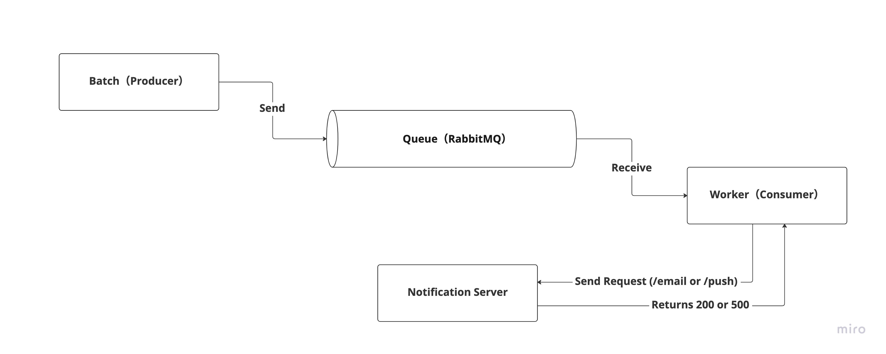

# batch-tracing-sample

A sample to trace async processes.



## Getting starteed

```sh
docker compose up -d
# Jaeger UI
http://localhost:16686/
# RabbitMQ (guest/guest)
http://localhost:15672/
```
